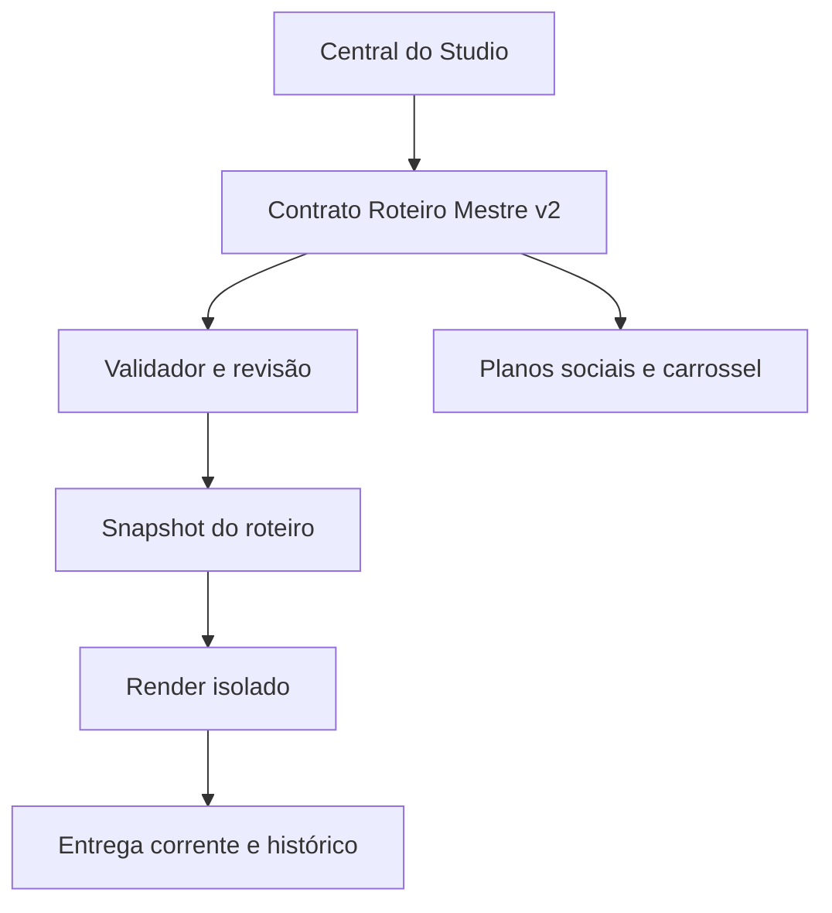
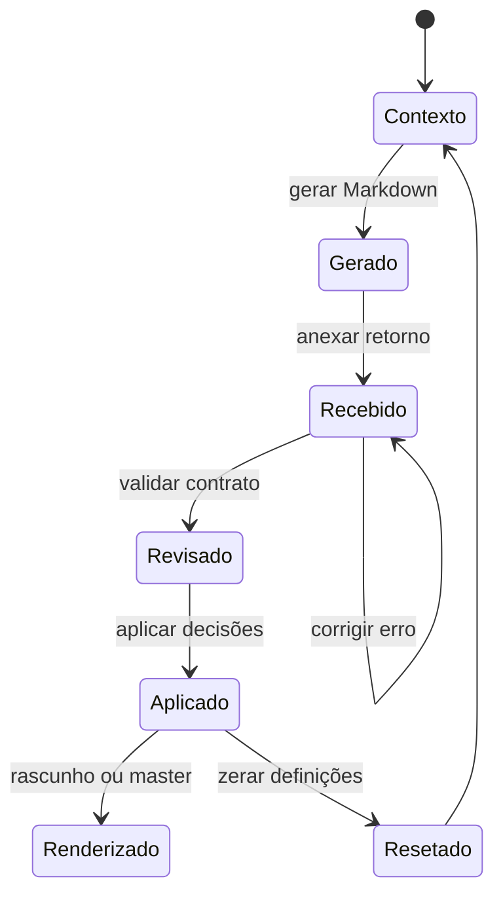

# FR AutoEdite 3.4.0 — arquitetura, UX e direção editorial

Este documento é a especificação operacional curta da **Central da IA**. O
arquivo `templates/ROTEIRO_MESTRE_PROMPT.md` é o contrato que vai para a IA; o
Studio e o CLI são os executores locais.

## 1. Arquitetura de referência



Camadas:

| Camada | Responsabilidade | Fonte de verdade |
|---|---|---|
| Entrada | ZIP, Takeout, contexto, originais e proxies | `_ENTRADA/`, `originais/`, `MANIFESTO_MEDIA.json` |
| Decisão | JSON v2 embutido no Markdown, estilo, publicação e estratégia | `ROTEIRO_MESTRE_RESPONDIDO.md` + JSON normalizado |
| Aplicação | Validação, cópia de segurança e publicação transacional | `app/master_contract.py`, `project_scope.py` |
| Execução | Frames, cards adaptativos, filtros, junções, áudio e FFmpeg | `app/fr_autoedite.py`, `media_frames.py`, `render_joins.py` |
| Produto | Player, auditoria, reset, versões, galeria e entrega | `app/studio.py` + `assets/studio/index.html` |

Um projeto contém mídias imutáveis e decisões substituíveis. Caminhos de
originais/proxies são referências; o Markdown não recebe credenciais, comandos
ou URLs de download.

## 2. Fluxo de UX/UI da Central da IA



1. **Preparar o pedido:** o usuário escreve o contexto factual e escolhe um
   nome de alternativa. O Studio gera um único Markdown com prompt, inventário,
   contrato e comentário `<!-- ROTEIRO: id -->`.
2. **Receber decisões:** o upload aceita somente UTF-8 Markdown. O validador
   exige exatamente um bloco JSON, schema v2, `project_id`, `media_fingerprint`,
   IDs existentes e janelas de tempo válidas.
3. **Revisão contextual:** a UI apresenta duração, cortes, cards, recortes
   repetidos, frames fixos, slides e avisos por bloco. Aviso é explicativo;
   erro bloqueia a aplicação.
4. **Aplicar:** uma cópia `antes-da-ia` é criada, a publicação é transacional e
   o usuário recebe `Resumo Executivo da IA` e relatório de aplicação.
5. **Alternativas:** guardar/restaurar versões não modifica outras versões. O
   reset arquiva escolhas para restauração e deixa mídias, proxies e manifesto.

### Mensagens de contexto que o Studio deve exibir

| Situação | Mensagem | Ação sugerida |
|---|---|---|
| Texto longo | “Texto denso para o tempo de tela.” | Reduzir a copy ou aumentar `duration_sec`. |
| Gancho lento | “A abertura passa de 2 s em card.” | Mostrar ação/detalhe primeiro; testar alternativa. |
| Quadro fora da cena | “Tempo fora da janela do vídeo-pai.” | Usar `scene_local` ou corrigir o segundo. |
| 3D sem prova de obra | “Render é visualização/projeto.” | Rotular como projeto; não chamar de execução. |
| Estabilização | “Pode criar bordas espelhadas.” | Conferir linhas e acabamento no player. |
| Reel fora do alvo | “Duração real diferente do alvo.” | Ajustar cortes; não esticar silenciosamente. |
| Mídia indisponível | “ID não pertence ao inventário atual.” | Gerar novo roteiro com os anexos atuais. |

## 3. Contrato executável v2

Cada ocorrência tem `segment_id` próprio; o mesmo `media_id` pode aparecer
quantas vezes forem necessárias. Para vídeo, `duration_sec × playback_speed`
é a janela consumida na fonte e não pode ultrapassar
`scene_start_sec..scene_end_sec`.

```python
def apply_returned_markdown(project, markdown):
    payload = parse_exact_json_block(markdown)       # um bloco, sem NaN/dupes
    bundle = validate_v2(payload, project.manifest)  # IDs, tempo, fontes, cards
    review = contextual_review(bundle)              # avisos, não mutações
    backup = snapshot_decisions(project, "antes-da-ia")
    publish_transactionally(project, bundle, backup)
    return review
```

Blocos principais:

- `configuration`: saída, áudio, estabilização, time-lapse e formatos;
- `main_timeline.segments`: lista completa do filme, na ordem de execução;
- `reels`: planos completos por duração (5–600 s), independentes do filme;
- `carousel.slides`: quantidade exata e ordem de cada slide;
- `stories`: Reel existente ou timeline própria;
- `card_style`: paleta, fontes instaladas, logo e overlays;
- `publication`: título, legenda, hashtags explícitas e CTA;
- `strategy`: hipótese de gancho, evidências, fatos a confirmar e teste A/B;
- `executive_summary`: auditoria legível para decisão humana.

## 4. Reset sem reenvio de mídias

```python
def reset_definitions(project):
    with project_lock(project):
        backup = snapshot_decisions(project, "antes-do-reset")
        keep = {"_ENTRADA", "originais", "originais_organizados", "proxies",
                "miniaturas", "MANIFESTO_MEDIA.json", "_TAKEOUT", "_HISTORICO"}
        remove_regenerable_decisions(project, keep)
        write_defaults(project, context="", active_status="reset")
        move_to_backup(project / "cards_editaveis", backup)
        return {"media_preserved": True, "backup": backup.name}
```

O lock `EDICAO.lock`, o journal `TRANSACTION.json` e a cópia anterior tornam a
operação recuperável mesmo se o processo for interrompido. A lixeira de
**Gerenciar** continua separada: ela só oferece arquivos regeneráveis e nunca
originais.

## 5. Renderização independente

No início de cada render, `isolated_render` copia decisões para:
`_RENDERIZACOES/<timestamp>_<roteiro>_<ação>/`. JSONs têm referências absolutas
congeladas e o manifesto é acompanhado por assinaturas de tamanho/mtime. A
renderização falha se uma mídia original mudar durante o trabalho.

```python
snapshot = freeze_decisions(project)
try:
    outputs = render(snapshot)
    assert source_signatures_unchanged(snapshot)
    publish_current_copy(outputs, project / "entrega")
    record_success(snapshot, outputs)
except Exception as error:
    record_failure(snapshot, error)
    raise
```

`entrega/` é apenas a cópia operacional da última versão. O snapshot anterior
permanece navegável e exportável; portanto, renderizar B não reescreve A.

## 6. Cards por serviço

O catálogo `templates/service_catalog.json` liga serviço a estrutura e asset:

| Serviço | Estrutura editorial |
|---|---|
| Projetos 3D | prancha, concepção e comparação |
| Pintura | preparo, camadas e acabamento |
| Textura | macro e materialidade |
| Revestimentos | paginação, juntas e sequência |
| Móveis | encaixe, detalhe e conjunto |
| Produções / Criações | ideia, protótipo e sequência |
| Alvenaria | base, etapas e estrutura |
| Iluminação | detalhe, atmosfera e linhas de luz |

Quando há `visual` ou `comparison`, o renderer usa frames reais do inventário.
Sem referência, usa apenas o símbolo oficial do serviço e deixa claro que é
uma categoria, não uma prova de execução.

## 7. Direção de atenção, marca e SEO

- **Abertura (0–2 s):** resultado parcial, gesto preciso ou detalhe que a
  mídia realmente sustenta; fechar a pergunta no final.
- **Desenvolvimento:** alternar escala, processo e micro-recompensas; cada corte
  acrescenta informação. Cards só entram quando orientam a leitura.
- **Clímax:** evidência do acabamento, encaixe, textura, evolução ou atmosfera.
- **CTA:** uma ação verificável (salvar referência, comentar uma decisão,
  compartilhar ou solicitar diagnóstico/orçamento).
- **Marca:** petróleo/carvão dominantes, osso/dourado para hierarquia, laranja
  como acento e tipografia FR instalada. Logo oficial sem deformar.
- **SEO social:** legenda natural com serviço, material, ambiente e local
  confirmados; hashtags ficam visíveis em `publication.hashtags`. Não existe
  hashtag oculta nem promessa de viralização.
- **A/B:** cada roteiro altera uma variável (gancho, primeiro frame ou CTA) e
  registra métrica, denominador, canal e janela. Não misturar alcance com
  visualizações nem inventar prova social/escassez.

## 8. API mínima e observabilidade

| Rota | Uso |
|---|---|
| `POST /api/editing-brief-upload` | validar e guardar retorno `.md` |
| `POST /api/action` | preparar, gerar, aplicar, renderizar e auditar |
| `POST /api/reset-definitions` | reset recuperável mantendo mídia |
| `POST /api/roteiro-save` / `roteiro-restore` | isolar alternativas |
| `GET /api/state` | estado, revisão, versões e último render |
| `GET /api/file` | download/stream com Range e path confinado |

Cada job registra ação, progresso, arquivo atual, duração, return code, erro e
heartbeat. Logs não incluem credenciais. O servidor escuta somente em
`127.0.0.1` e exige token de sessão.

## 9. Critérios de aceite 3.4.0

- um retorno válido altera a configuração apenas depois da revisão;
- retorno inválido não escreve plano, estilo, mídia ou credenciais;
- reset mantém `MANIFESTO_MEDIA.json`, ZIP, originais, proxies e assinaturas;
- duas alternativas têm snapshots e renders distintos;
- cards de serviços diferentes produzem layouts realmente diferentes;
- frames usados como foto correspondem ao vídeo e ao segundo informados;
- todos os outputs passam `ffprobe` e são reproduzíveis com proxies;
- a suíte `tests/master_contract_test.py` (14), HTTP, recuperação, cards,
  preparação e `tests/smoke_test.sh` ficam verdes antes de empacotar.
