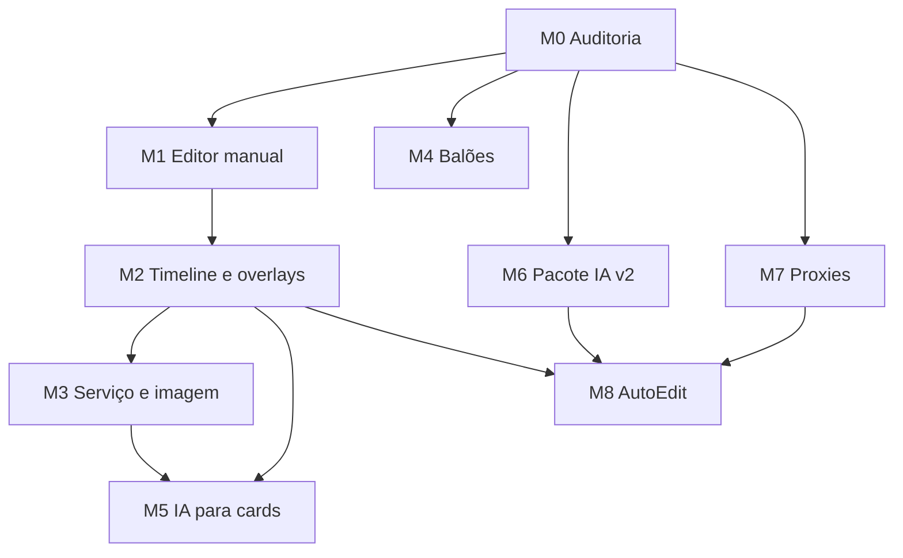

# Dependências e sequência

## Mapa confirmado parcialmente pela leitura remota

Setas representam pré-requisito para o escopo atual recomendado, sujeitas à correção de M0. M4 pode começar depois de M0 se o renderer de overlays estiver suficientemente isolado, mas só integrar junto à timeline quando M2 demonstrar paridade. M5 deve usar validator existente/migrado e nunca ser pré-requisito para modo sem IA. M6 e M7 podem ter planejamento independente após M0, mas a geração de pacote final requer integridade comprovada dos proxies. M8 usa o baseline já presente (`build_auto_plan`/`build_random_plan`), não parte do zero.

## Relações concretas preliminares no remoto `915c13c`

| Fluxo | Código/artefato preliminar | Implicação |
|---|---|---|
| Studio/API | `app/studio.py`, `assets/studio/index.html`, launcher | M1 precisa estudar autenticação e servir assets do editor com segurança. |
| Cards atuais | `app/fr_v4/bridge.py`, `app/fr_v4/core/card_renderer.py`, `app/service_cards.py`, `templates/card_style.json` | M1 adapta com fallback; M3 confronta círculo e 1:1 existentes. |
| Planos | `app/fr_autoedite.py`, `app/master_contract.py`, `app/ready_video.py`; `EDIT_PLAN.json` e `READY_VIDEO_PLAN.json` | M2 não mistura segmentos sequenciais com overlays sobre base bloqueada. |
| IA | `app/master_contract.py:generate`, `app/fr_autoedite.py:refresh_ai_package_documents/create_chatgpt_package`, template Markdown | M6 refaz geração sem se apoiar em texto anterior e sem perder migração. |
| Proxies | `build_manifest`, `create_video_proxy`, `create_chatgpt_package` | M7 valida reutilização, cobertura, lote. |
| Balões | `app/fr_v4/overlays.py:render_overlay`, `ready_video.py:overlay_image` | M4 precisa teste preview/master. |

## Gates

- G0 M0: situação Git/local e contratos comprovados; atualizar M1–M8 se divergir.
- G1 M1: edição manual persistente, preview e fallback real comprovados.
- G2 M2/M3: placement e círculos corretos em raw/ready e formatos suportados.
- G3 M4/M5: overlay sem colisão silenciosa e sugestões IA validadas.
- G4 M6/M7: pacote novo determinístico e integridade/cobertura verificáveis.
- G5 M8: baseline automático melhorado e render de draft válido sem nuvem.

Track B Next é independente: `PART1 → PART2 → conflitos → Red Team → spikes → Architecture Freeze → Codex Execution Plan → vertical slice futuro`.
